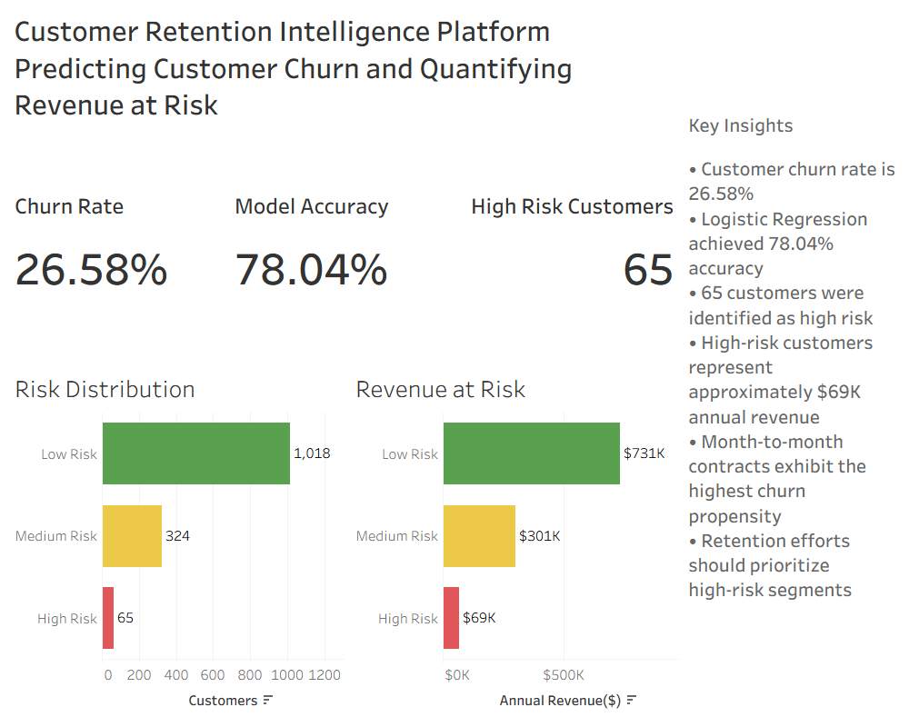

# Customer Retention Intelligence Platform

## Predicting Customer Churn and Quantifying Revenue at Risk

This project develops an end-to-end Customer Retention Intelligence Platform that combines machine learning, business intelligence, and customer risk segmentation to identify customers likely to churn and estimate the revenue impact of customer attrition.

---

## Business Problem

Customer churn directly affects revenue growth and customer lifetime value.

The objective of this project is to:

- Predict customer churn
- Identify high-risk customers
- Quantify revenue at risk
- Support proactive retention strategies
- Provide executive-level business insights

---

## Tools & Technologies

- Python
- Pandas
- NumPy
- Scikit-Learn
- Tableau
- SQL
- GitHub

---

## Dataset

Telco Customer Churn Dataset

- Total Customers: 7,032
- Churned Customers: 1,869
- Churn Rate: 26.58%

---

## Project Workflow

### Data Preparation

- Data Cleaning
- Feature Engineering
- Risk Segmentation

### Exploratory Analysis

- Churn Analysis by Contract Type
- Churn Analysis by Internet Service
- Churn Analysis by Payment Method

### Machine Learning

- Logistic Regression
- Random Forest
- Model Comparison
- Customer Risk Scoring

### Business Intelligence

- Revenue at Risk Analysis
- Feature Importance Analysis
- Executive Tableau Dashboard

---

## Machine Learning Results

| Model | Accuracy |
|---------|----------|
| Logistic Regression | 78.04% |
| Random Forest | 75.41% |

Logistic Regression was selected as the final predictive model due to superior performance.

---

## Feature Importance

Top churn drivers identified by the Random Forest model:

1. Monthly Charges
2. Total Charges
3. Customer Tenure
4. Senior Citizen Status

These factors contribute most significantly to customer churn behavior.

---

## Key Business Insights

- Churn Rate: 26.58%
- Model Accuracy: 78.04%
- High-Risk Customers Identified: 65
- Revenue at Risk (High Risk Segment): ~$69K annually
- Month-to-month contracts exhibit the highest churn propensity

---

## Dashboard



---

## Business Recommendations

### Immediate Actions

- Prioritize outreach to high-risk customers
- Offer retention incentives for month-to-month customers
- Improve onboarding experience for new customers

### Strategic Actions

- Promote longer contract commitments
- Optimize pricing strategies
- Monitor churn risk continuously through predictive analytics

---

## Repository Structure

```text
Customer_Retention_Intelligence_Platform.ipynb
Customer Retention Intelligence Platform.twb
customer_retention_dashboard.png

customer_churn_cleaned.csv

create_tables.sql
data_analysis_queries.sql

data_dictionary.md
insights.md

python_data_cleaning.py
```

---

## Author

**Gopi Krishna Praveen Reddy Doranala**

MS Business Analytics

University of North Texas
